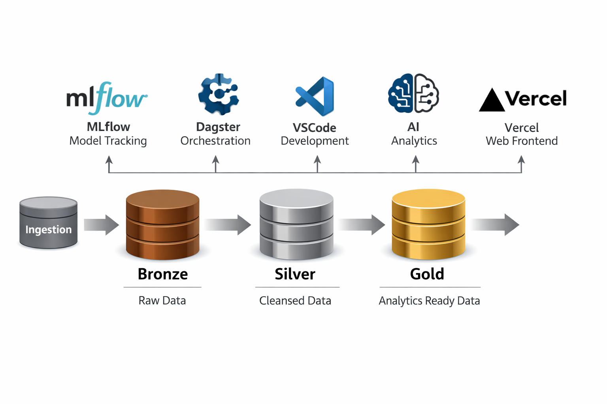

# High‑level architecture

The ZINC Fusion V15 platform implements a modular lake‑house architecture built on open standards. Incoming data flows through ingestion pipelines into a **Bronze** layer where raw files are stored. From there, **Dagster** orchestrates validation, deduplication and enrichment processes that populate **Silver** tables. Final **Gold** tables provide curated, aggregated data for analytics and reporting. Throughout this flow, the platform enforces ACID guarantees using Delta‑Lake–style transaction logs and a versioned object store.

Key components:

- **Dagster** orchestrates ETL/ELT workflows, ensuring dependencies and retries are managed declaratively.
- **MLFlow** tracks experiments and models trained on Silver/Gold data, providing reproducibility and model registry capabilities.
- **VS Code** (via remote containers) provides a consistent development environment for notebooks and pipelines.
- **AI services** (e.g., large‑language models and AutoML) augment feature engineering and analytics.
- **Vercel** hosts web front‑ends for dashboards and interactive applications built on the Gold layer.
- **DuckDB** offers an embedded, in‑process SQL analytics engine for rapid local queries on parquet or CSV files.  It is used in notebooks and interactive analyses where running small to medium‑sized queries locally is more efficient than using the distributed lakehouse.

