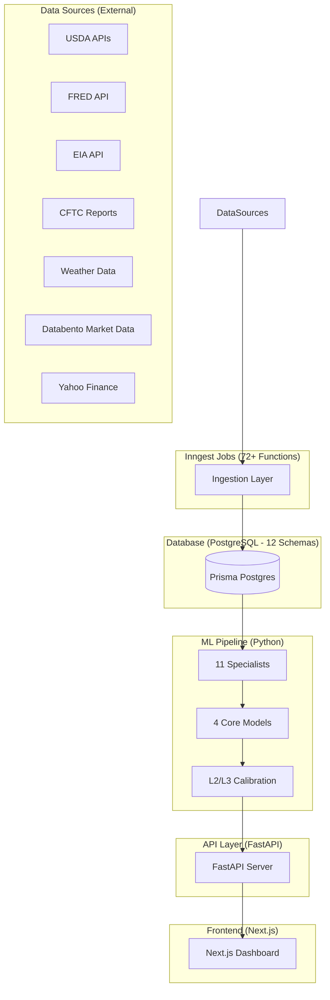
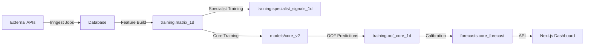

# ZINC-FUSION-V15 Comprehensive Forensic Architecture Analysis

**Created:** 2026-03-05  
**Classification:** Proprietary - US Oil Solutions  
**Analysis Type:** Complete Codebase Forensic Examination

---

## Executive Summary

ZINC-FUSION-V15 is an institutional-grade quantitative forecasting system for ZL (soybean oil futures) commodity procurement. The system implements a 4-layer hierarchical ensemble ML pipeline that predicts future ZL futures contract prices across multiple time horizons and wraps predictions with probability assessments rendered as horizontal Target Zones on the dashboard.

**Client:** US Oil Solutions (Las Vegas, NV)  
**Product:** Bulk soybean oil for restaurant/casino fryers  
**Business Impact:** $250K+ cost avoidance through strategic timing

---

## 1. System Architecture Overview

### 1.1 High-Level Component Map



### 1.2 Technology Stack

| Layer           | Technology                               | Purpose                             |
| --------------- | ---------------------------------------- | ----------------------------------- |
| Database        | Prisma PostgreSQL (cloud)                | 12 schemas, single source of truth  |
| Backend         | Python 3.11, FastAPI, psycopg2           | ML pipeline, API server             |
| ML              | AutoGluon (CPU-only), custom specialists | Price prediction, signal generation |
| Frontend        | Next.js on Vercel, TypeScript            | Dashboard visualization             |
| Job Scheduling  | Inngest (serverless functions)           | 72+ data ingestion jobs             |
| Package Manager | uv (Python), npm (frontend/config)       | Dependency management               |
| Testing         | pytest (Python), npm test (frontend)     | Quality assurance                   |
| ML Tracking     | MLflow (local)                           | Experiment tracking                 |

---

## 2. Database Architecture (12 Schemas)

### 2.1 Schema Catalog

| Schema      | Purpose                                    | Key Tables                                       |
| ----------- | ------------------------------------------ | ------------------------------------------------ |
| `mkt`       | Market data (prices, FX, futures, options) | futures, fx, options, etf                        |
| `econ`      | Economic indicators (FRED series)          | rates, inflation, labor, activity, vol_indices   |
| `alt`       | Alternative data (news, weather, tariffs)  | econ_news, legislation, weather                  |
| `pos`       | Positioning data (CFTC COT)                | cftc_1w                                          |
| `supply`    | Supply-side data (USDA, EIA, EPA)          | wasde, exports, biodiesel, rin_prices            |
| `features`  | Derived features                           | elite_1d                                         |
| `training`  | Training matrices and OOF                  | matrix_1d, oof_core_1d, specialist_signals_1d    |
| `model`     | Model registry                             | model_registry                                   |
| `forecasts` | Forecast outputs                           | core_forecast, ai_decision, garch_forecast       |
| `analytics` | Derived analytics                          | board_crush_1d, driver_attribution, regime_state |
| `ops`       | Operations monitoring                      | ingest_runs, pipeline_alerts, data_quality       |
| `vegas`     | Vegas restaurant intelligence              | restaurants, casinos, events                     |

### 2.2 Database Query Strategy

- **Prisma**: Schema management and migrations ONLY
- **Runtime Queries**: Direct `pg` Pool (TypeScript) and `psycopg2` (Python)
- **Rationale**: PrismaClient adds overhead; direct queries are faster for large datasets

---

## 3. ML Model Architecture

### 3.1 Layer 0: Core Price Predictor

**Purpose:** Predict future ZL futures contract price (single number per horizon)

**Configuration:**

- 4 AutoGluon TimeSeriesPredictor models (one per horizon)
- Horizons: 5d, 21d, 63d, 126d
- Target: `target_price_{h}d` (future price, NOT returns)
- Metric: MAE (point forecast accuracy)
- Validation: 4 expanding windows
- Frequency: Business day (`B`)
- Time limit: None (explicit model allowlist)

**Active Model Zoo (19 models):**

| Category         | Models                                                                                      |
| ---------------- | ------------------------------------------------------------------------------------------- |
| Baselines (5)    | Naive, SeasonalNaive, Average, SeasonalAverage, Zero                                        |
| Statistical (10) | ETS, AutoETS, AutoARIMA, AutoCES, Theta, DynamicOptimizedTheta, NPTS, ADIDA, Croston, IMAPA |
| Tabular TS (3)   | DirectTabular, PerStepTabular, RecursiveTabular                                             |
| Foundation (1)   | Chronos2 (120M-param, zero-shot)                                                            |

**Output:** Single `predicted_price` per horizon (NO quantiles from core)

**Artifacts Location:** `models/core_v2/{horizon}d/`

### 3.2 Layer 0: Big-11 Specialist Signal Generators

**Purpose:** Domain-specific signal generators producing compact signals for core model consumption

| Bucket       | Model Type    | Implementation                    | Signal Contract                       |
| ------------ | ------------- | --------------------------------- | ------------------------------------- |
| crush        | `gbm`         | sklearn GradientBoostingRegressor | Crush margin z-score + momentum       |
| china        | `gbm`         | sklearn GradientBoostingRegressor | Demand outlook + Brazil competition   |
| substitutes  | `rf`          | sklearn RandomForestRegressor     | Substitution pressure + richness      |
| fx           | `ardl`        | statsmodels ARDL                  | FX pressure index + carry             |
| fed          | `ridge`       | sklearn Ridge                     | Rates regime + change                 |
| tariff       | `tree`        | Rule-based + EPU analysis         | Tariff risk + EPU spike               |
| energy       | `var`         | statsmodels VAR + IRF             | Energy spillover + momentum           |
| biofuel      | `nlp_ema`     | NLP sentiment + EMA               | Policy pressure + trend               |
| palm         | `ecm_ridge`   | statsmodels ECM + sklearn Ridge   | Cointegration + mean reversion        |
| volatility   | `garch`       | arch GJR-GARCH(1,1)               | Conditional variance z-score + regime |
| trump_effect | `event_study` | Event intensity scoring           | Intensity + volatility impact         |

**Output:** Each specialist outputs `(signal_1, signal_2, confidence)` per date to `training.specialist_signals_1d`

**Signal Columns:** 33 total (11 buckets × 3 signals)

### 3.3 Layer 1: Meta Features

Specialist signals are merged into `training.matrix_1d` as core input features (~213+ total features)

### 3.4 Layer 2-3: Probability Calibration

**Input:** Core's `predicted_price`  
**Output:** Horizontal Target Zones with probability statements

**Probability Sources:**

1. Monte Carlo simulation (10,000 runs)
2. Pinball loss calibration
3. MAE/accuracy %

**Example Output:** "ZL has an 88% chance of hitting 48.52 by July 7th"

---

## 4. Data Pipeline Architecture

### 4.1 Ingestion Functions (72+ Inngest Jobs)

Located in `frontend/src/inngest/functions.ts`:

| Category    | Functions                                                       |
| ----------- | --------------------------------------------------------------- |
| ZL Price    | zl15m, zl1h, zlDaily, zlLive\*                                  |
| FRED Data   | fredDaily\* (10 categories)                                     |
| Market Data | cftcWeekly, databentoFutures*, databentoFx*, databentoOptions\* |
| Supply Data | usdaExportSalesWeekly, usdaWasdeMonthly, boardCrushDaily        |
| Weather     | noaaWeatherDaily, openmeteoWeatherDaily, weatherFeaturesDaily   |
| Biofuel     | epaRinPricesDaily, eiaBiodiesel\*                               |
| News        | usdaDaily, eiaDaily, federalRegisterDaily, conabNewsDaily       |
| Vegas       | glideVegasSync                                                  |

### 4.2 Feature Matrix Build

**File:** `src/fusion/core_training/build_matrix.py`

**Sources for training.matrix_1d:**

- alt.weather_1d (weather aggregates)
- econ.\* tables (rates, inflation, labor, activity, vol_indices, commodities, money)
- mkt.fx_1d (FX rates)
- pos.cftc_1w (COT managed money, commercials)
- supply.epa_rin_1d (biofuel RIN prices)
- supply.usda_exports_1w (export sales)
- supply.usda_wasde_1m (WASDE supply/demand balances)
- training.specialist_signals_1d (specialist outputs)

**Feature Count:** ~213+ features after curation

**Design Principles:**

- Blanket inclusion with enforced curation
- All features as OBSERVED covariates (not known)
- RAW features stored (NO global normalization)
- Normalization happens per CV window (prevents leakage)

### 4.3 Forward Fill Policy

**File:** `src/fusion/config/forward_fill_config.py`

**TTL Thresholds:**

- Daily: 3 days (business day tolerance)
- Weekly: 10 days (~1.5x cadence)
- Monthly: 45 days (~1.5x cadence)
- Quarterly: 120 days (~1.33x cadence)

**Forbidden Column Suffixes:**
`_*_delta, *_chg, *_pct*, *_ret*, *_mom, *_vol, *_z*, *_zscore*, *_surprise*, *_return*, *_spread*, *_ratio*`

---

## 5. API Architecture

### 5.1 Backend API (FastAPI)

**Location:** `src/fusion/api/routers/`

| Router                | Purpose              |
| --------------------- | -------------------- |
| market.py             | Market data queries  |
| overview.py           | System overview      |
| pulse.py              | News pulse retrieval |
| market_drivers.py     | Market drivers data  |
| sentiment_strategy.py | Sentiment analysis   |
| db_explorer.py        | Database exploration |

### 5.2 Frontend API Routes (Next.js)

**Location:** `frontend/src/app/api/`

| Endpoint              | Purpose                                        |
| --------------------- | ---------------------------------------------- |
| `/api/zl/brief`       | ZL forecast brief with multi-component scoring |
| `/api/zl/forecast`    | ZL price forecasts                             |
| `/api/zl/live`        | Live ZL price                                  |
| `/api/market-drivers` | Market drivers (23 parallel DB queries)        |
| `/api/sentiment/*`    | Sentiment analysis endpoints                   |
| `/api/inngest`        | Inngest webhook handler                        |
| `/api/vegas/*`        | Vegas restaurant intelligence                  |

---

## 6. Frontend Architecture

### 6.1 Pages

**Location:** `frontend/src/app/`

| Page        | Route          | Purpose                     |
| ----------- | -------------- | --------------------------- |
| Dashboard   | `/dashboard`   | Main forecast visualization |
| Sentiment   | `/sentiment`   | News sentiment analysis     |
| Strategy    | `/strategy`    | Strategic recommendations   |
| Legislation | `/legislation` | Policy/legislation tracking |
| Vegas Intel | `/vegas-intel` | Restaurant intelligence     |
| Quant       | `/quant`       | Quantitative analysis       |
| Login       | `/login`       | Authentication              |

### 6.2 Key Components

**Location:** `frontend/src/components/`

| Component                         | Purpose                       |
| --------------------------------- | ----------------------------- |
| ZlBrief.tsx                       | ZL forecast summary card      |
| LightweightZlCandlestickChart.tsx | Price chart with Target Zones |
| RegimeAnalysisChart.tsx           | Market regime visualization   |
| ForecastTargetsPrimitive.ts       | Target zone rendering         |
| FusionBrain.tsx                   | AI-driven market intelligence |

### 6.3 Service Layers

**Location:** `frontend/src/lib/`

| Service                            | Purpose                 |
| ---------------------------------- | ----------------------- |
| services/market-drivers-queries.ts | 23 parallel DB queries  |
| services/china-service.ts          | China-specific data     |
| services/crush-service.ts          | Crush margin data       |
| services/energy-service.ts         | Energy market data      |
| services/policy-service.ts         | Policy analysis         |
| services/vix-service.ts            | VIX/volatility data     |
| ai-intelligence.ts                 | AI narrative generation |
| ai-driver-intel.ts                 | Driver attribution      |

---

## 7. Infrastructure

### 7.1 Docker Services

**Files:**

- `docker-compose.mcp.yml` - MCP server stack
- `docker-compose.inngest.yml` - Inngest dev server

**MCP Servers (Ports):**

- memory → 18100
- sequential-thinking → 18101
- context7 → 18102

**Inngest Dev:**

- Port 8288

### 7.2 Port Assignments (LOCKED)

| Port | App             | Purpose                     |
| ---- | --------------- | --------------------------- |
| 3000 | ZINC-FUSION-V15 | Next.js dev + Inngest serve |
| 3001 | external-project | Alternative Next.js dev    |
| 8288 | inngest-dev     | Inngest dev server          |

### 7.3 Makefile Targets

**Location:** `Makefile`

| Target                       | Purpose                         |
| ---------------------------- | ------------------------------- |
| make check                   | Full verification gate          |
| make verify                  | Run scripts/verify.sh           |
| make lint                    | Python linting                  |
| make test                    | Python tests                    |
| make mcp-up/mcp-down         | MCP server control              |
| make inngest-up/inngest-down | Inngest control                 |
| make inngest-guard           | Static analysis + health checks |
| make inngest-heal            | Self-healing loop               |

---

## 8. Data Source Catalog

### 8.1 Integrated Sources

| Source                | Status                 | Data Type                 |
| --------------------- | ---------------------- | ------------------------- |
| FRED API              | WORKING (130+ series)  | Macro indicators          |
| USDA FAS Export Sales | WORKING                | Export data               |
| EPA RIN Prices        | WORKING (source limit) | Biofuel credits           |
| Databento             | WORKING                | Futures, FX, options      |
| Yahoo Finance         | WORKING                | Index/ETF prices          |
| Board Crush           | WORKING                | Crush margin calculations |

### 8.2 Not Yet Integrated

| Source                     | Status    |
| -------------------------- | --------- |
| USDA NASS QuickStats API   | Not built |
| WASDE Reports              | Not built |
| CFTC Disaggregated Reports | Not built |
| BLS API                    | Not built |
| NOAA Weather               | Not built |
| EIA Weekly Petroleum       | Not built |

---

## 9. System Integration Points

### 9.1 Data Flow



### 9.2 Key File Dependencies

| File                           | Depends On                   | Provides                       |
| ------------------------------ | ---------------------------- | ------------------------------ |
| build_matrix.py                | All econ/mkt/supply tables   | training.matrix_1d             |
| train_models.py                | build_matrix.py, config.py   | models/core_v2/{horizon}d      |
| generate_specialist_signals.py | specialist loaders           | training.specialist_signals_1d |
| run_monte_carlo.py             | oof_core_1d                  | forecasts.core_mc              |
| ai-intelligence.ts             | forecasts.\*, market_drivers | AI narratives                  |

---

## 10. Configuration Files

| File                                     | Purpose                                  |
| ---------------------------------------- | ---------------------------------------- |
| pyproject.toml                           | Python dependencies (root)               |
| frontend/package.json                    | Frontend dependencies                    |
| config/package.json                      | Prisma CLI dependencies                  |
| prisma/schema.prisma                     | Database schema (single source of truth) |
| src/fusion/config.py                     | Global Python config                     |
| src/fusion/core_training/config.py       | Core model config                        |
| src/fusion/config/forward_fill_config.py | Forward fill TTLs                        |

---

## 11. Validation & Quality Assurance

### 11.1 Pre-Training Validation

**Location:** `src/fusion/validators/`

| Validator              | Purpose                 |
| ---------------------- | ----------------------- |
| anomaly_detection.py   | Detect data anomalies   |
| quarantine_verifier.py | Verify quarantined data |
| run_all.py             | Run all validators      |

### 11.2 Data Quality Checks

**Location:** `src/fusion/validation/`

| Module             | Purpose                   |
| ------------------ | ------------------------- |
| all_data_policy.py | Comprehensive data policy |
| data_quality.py    | Quality metrics           |

---

## 12. Scripts & Utilities

### 12.1 Key Scripts

| Script                                 | Purpose                      |
| -------------------------------------- | ---------------------------- |
| scripts/run_pipeline.py                | Full training pipeline       |
| scripts/generate_specialist_signals.py | Specialist signal generation |
| scripts/run_monte_carlo.py             | Monte Carlo simulation       |
| scripts/evaluate_oof.py                | OOF evaluation               |
| scripts/preflight_check.py             | Pre-flight validation        |
| scripts/verify.sh                      | Full verification            |

---

## 13. Critical Architectural Rules (from AGENTS.md)

1. **Core = Price Predictor**: Outputs single `predicted_price` (NOT quantiles)
2. **Always 11 Specialists**: Never say "10 specialists" - trump_effect is #11
3. **Target is Price**: NOT returns. Columns named `target_price_{h}d`
4. **Probability = L2/L3**: Monte Carlo + pinball + MAE/accuracy %
5. **Banned Words**: "cones", "probability cone", "confidence band", "cents/lb"
6. **Correct Language**: "Target Zones", "ZL futures contract price", "ZL has X% chance of hitting..."
7. **Banned Schemas**: raw, gold, silver, bronze, monitoring, specialist, weather, archive

---

## 14. Directory Structure Summary

```
ZINC-FUSION-V15/
├── src/fusion/           # Python ML pipeline
│   ├── api/              # FastAPI server
│   ├── core_training/   # Core model training
│   ├── specialists/     # 11 specialist implementations
│   ├── features/        # Feature engineering
│   ├── ingestion/       # Data ingestion
│   ├── validation/      # Data validation
│   └── ...
├── frontend/            # Next.js dashboard
│   ├── src/app/        # Pages and API routes
│   ├── src/components/ # React components
│   ├── src/lib/        # Services and utilities
│   └── src/inngest/    # Inngest job definitions
├── prisma/             # Database schema
├── config/             # Prisma CLI config
├── scripts/            # Pipeline scripts
├── models/             # Trained model artifacts
├── Docs/              # Documentation
├── reports/            # Analysis reports
└── Makefile           # Build targets
```

---

## 15. Findings Summary

### 15.1 Strengths

1. **Well-architected ML pipeline**: Clear separation between specialists, core, and calibration
2. **Comprehensive data integration**: 72+ ingestion jobs covering major data sources
3. **Strong typing**: TypeScript frontend, Prisma schema, Python type hints
4. **Robust validation**: Multiple validation layers before training
5. **Clear terminology**: Strict vocabulary rules prevent ambiguity

### 15.2 Areas for Investigation

1. **Data freshness**: Some sources marked as STALE (e.g., econ.activity_1d)
2. **API reliability**: EIA API marked as DOWN since ~Mar 1
3. **Source limits**: Several APIs at source data limits
4. **Not integrated sources**: CFTC disaggregated, BLS, NOAA not yet built

### 15.3 Key Interconnections

1. Specialists → Core: Signals feed into training matrix
2. Core → Calibration: OOF predictions feed probability engine
3. Database → All: 12 schemas serve as single source of truth
4. Inngest → Database: 72+ jobs populate all tables
5. API → Frontend: Dashboard consumes all forecast outputs

---

_End of Forensic Architecture Analysis_
